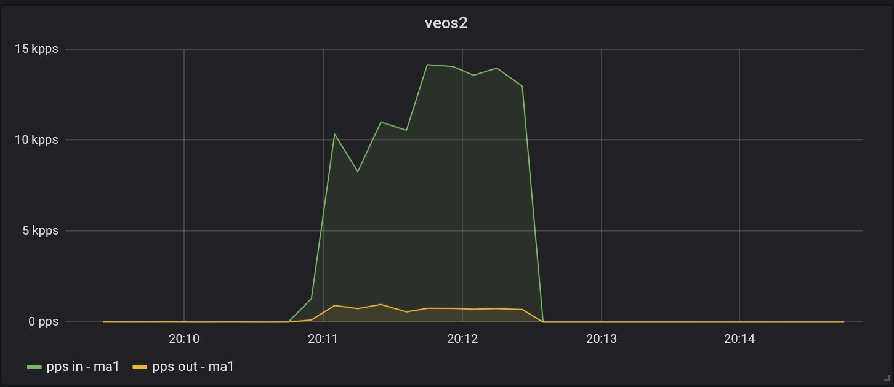

The following is an example of polling an Arista vEOS switch.
This assumes panoptes is already setup.

Arista vEOS 4.20.7M was used for testing
 

##### vEOS

vEOS management was already setup, and the following snmp config added:

```
snmp-server chassis-id veos2
snmp-server contact lab
snmp-server location lab
snmp-server community public ro
```

Confirm that snmp is working on vEOS switch:

```
snmpwalk -v 2c -c public -O e <veos-ip> SNMPv2-MIB::sysDescr.0
```

Should get back

```
SNMPv2-MIB::sysDescr.0 = STRING: Arista Networks EOS version 4.20.7M running on an Arista Networks vEOS
```


##### Add device to discovery file

```bash
nano /home/panoptes/plugins/discovery/localhost.json
```

The contents should be like so, where localhost was already added and the new switch is the 2nd entry:

```bash
[
  {
    "resource_plugin": "plugin_discovery_from_json_file",
    "resource_site": "local",
    "resource_class": "system",
    "resource_subclass": "host",
    "resource_type": "generic",
    "resource_id": "localhost",
    "resource_endpoint": "localhost",
    "resource_creation_timestamp": "1512629517.03121",
    "resource_metadata": {
      "_resource_ttl": "900"
    }
  },
  {
    "resource_plugin": "plugin_discovery_from_json_file",
    "resource_site": "local",
    "resource_class": "network",
    "resource_subclass": "switch",
    "resource_type": "arista",
    "resource_id": "veos",
    "resource_endpoint": "192.168.0.199",
    "resource_creation_timestamp": "1512629517.03121",
    "resource_metadata": {
      "_resource_ttl": "900"
    }
  }
]
```

##### Add Arista interface enrichment plugin

```bash
mkdir -p /home/panoptes/plugins/enrichment/interface/arista
nano /home/panoptes/plugins/enrichment/interface/arista/plugin_enrichment_interface_arista.panoptes-plugin
```

Add the following to the file:

```
[Core]
Name = Arista Interface Enrichment Plugin
Module = /home/panoptes/package/lib/python2.7/site-packages/yahoo_panoptes/plugins/enrichment/interface/arista/plugin_enrichment_interface_arista.py

[Documentation]
Author = Oath, Inc.
Version = 0.1
Website = https://github.com/yahoo/panoptes
Description = Plugin to collect interface enrichment for arista devices

[main]
execute_frequency = 300
resource_filter = resource_class = "network" AND resource_type = "arista"
enrichment_ttl = 900

[snmp]
max_repetitions = 25
timeout = 10
retries = 2
```

```bash
nano /home/panoptes/package/lib/python2.7/site-packages/yahoo_panoptes/plugins/enrichment/interface/arista/plugin_enrichment_interface_arista.py
```

Change the first line:

```bash
from yahoo_panoptes.plugins.enrichment.interface.plugin_enrichment_interface import PluginEnrichmentInterface
```

##### Add Arista's to polling plugin


```bash
nano /home/panoptes/plugins/polling/plugin_polling_device_interface_metrics_arista.panoptes-plugin
```

Add the following to the file:

```bash
[Core]
Name = Device Interface Metrics Plugin
Module = /home/panoptes/package/lib/python2.7/site-packages/yahoo_panoptes/plugins/polling/interface/plugin_polling_device_interface_metrics.py

[Documentation]
Author = Oath, Inc.
Version = 0.1
Website = https://github.com/yahoo/panoptes
Description = This plugin can poll any device supporting IF-MIB for interface metrics.

[main]
execute_frequency = 60
resource_filter = resource_class = "network" AND resource_type = "arista"

[snmp]
max_repetitions = 25

[enrichment]
preload = self:interface
```


##### Grafana Graph

Browse to http://serverip:3000
Add a new graph with these two queries:

```
SELECT derivative(mean("total_packets_in__counter"),1s) AS "packets_in" FROM "interface" WHERE ("resource_endpoint" = '<device_ip>' AND "interface_name" = 'Management1') AND $timeFilter GROUP BY time($__interval) fill(none)


SELECT derivative(mean("total_packets_out__counter"),1s) AS "packets_out" FROM "interface" WHERE ("resource_endpoint" = '<device_ip>' AND "interface_name" = 'Management1') AND $timeFilter GROUP BY time($__interval) 
```

Test by downloading some big files on the local system and check the graphs:



Note: It seems veos doesn't record bits_in or bits_out, values are always zero hence the graph is just showing packets per second. This shouldn't be a problem on real world kit
