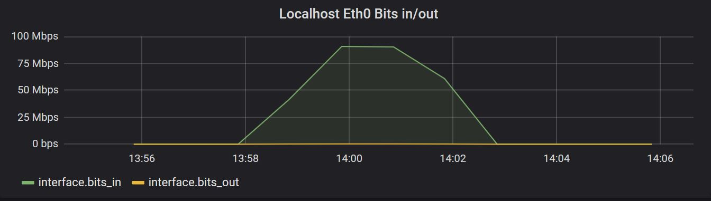

### System Requirements

The following is an example setup using Centos7.4 as a base OS.
Services will run in the foreground.

#### To Do:

 - Supervisor config to run services in the background
 

##### EPEL

EPEL is needed to install many of the requirements for Panoptes

```bash
yum install epel-release
```

##### Redis

```bash
yum install redis
systemctl start redis.service
systemctl enable redis.service
```

##### ZooKeeper

```bash
useradd zookeeper
wget https://archive.cloudera.com/cdh5/one-click-install/redhat/7/x86_64/cloudera-cdh-5-0.x86_64.rpm
yum --nogpgcheck localinstall cloudera-cdh-5-0.x86_64.rpm
yum install zookeeper 
yum install zookeeper-server
yum install java-1.8.0-openjdk
mkdir -p /var/lib/zookeeper
chown -R zookeeper /var/lib/zookeeper/
zookeeper-server-initialize
```

```bash
nano /etc/systemd/system/zookeeper.service
```

Add the following to the file:

```bash
[Unit]
Description=Apache Zookeeper server 
Documentation=http://zookeeper.apache.org
Requires=network.target remote-fs.target 
After=network.target remote-fs.target

[Service]
Type=forking
User=zookeeper
Group=zookeeper
ExecStart=/usr/lib/zookeeper/bin/zkServer.sh start
ExecStop=/usr/lib/zookeeper/bin/zkServer.sh stop
ExecReload=/usr/lib/zookeeper/bin/zkServer.sh restart
WorkingDirectory=/var/lib/zookeeper

[Install]
WantedBy=multi-user.target
```

```bash
systemctl start zookeeper.service
systemctl enable zookeeper.service
```


##### Kafka

```bash
wget https://archive.apache.org/dist/kafka/0.10.2.1/kafka_2.11-0.10.2.1.tgz
tar -xvf kafka_2.11-0.10.2.1.tgz
mv kafka_2.11-0.10.2.1 /opt/
useradd kafka
chown -R kafka /opt/kafka_2.11-0.10.2.1/
ln -s /opt/kafka_2.11-0.10.2.1 /opt/kafka
chown -h kafka /opt/kafka
chown -R kafka /tmp/kafka-logs/
```

```bash
nano /etc/systemd/system/kafka.service
```

Add the following to the file:

```bash
[Unit]
Description=Apache Kafka server (broker)
Documentation=http://kafka.apache.org/documentation.html
Requires=network.target remote-fs.target 
After=network.target remote-fs.target zookeeper.service

[Service]
Type=simple
User=kafka
Group=kafka
Environment=JAVA_HOME=/etc/alternatives/jre
ExecStart=/opt/kafka/bin/kafka-server-start.sh /opt/kafka/config/server.properties
ExecStop=/opt/kafka/bin/kafka-server-stop.sh

[Install]
WantedBy=multi-user.target
```

```bash
systemctl start kafka.service
systemctl enable kafka.service
```


##### InfluxDB

```bash
nano /etc/yum.repos.d/influxdb.repo
```
Add the following to the file:

```bash
[influxdb]
name = InfluxDB Repository - RHEL \$releasever
baseurl = https://repos.influxdata.com/rhel/\$releasever/\$basearch/stable
enabled = 1
gpgcheck = 1
gpgkey = https://repos.influxdata.com/influxdb.key
```

```
yum makecache fast
yum -y install influxdb
systemctl start influxdb && systemctl enable influxdb
firewall-cmd --add-port=8086/tcp --permanent
firewall-cmd --reload
```

##### Grafana

```bash
nano /etc/yum.repos.d/grafana.repo
```

Add the following to the file:

```bash
[grafana]
name=grafana
baseurl=https://packagecloud.io/grafana/stable/el/7/$basearch
repo_gpgcheck=1
enabled=1
gpgcheck=1
gpgkey=https://packagecloud.io/gpg.key https://grafanarel.s3.amazonaws.com/RPM-GPG-KEY-grafana
sslverify=1
sslcacert=/etc/pki/tls/certs/ca-bundle.crt
```

```bash
yum install grafana
systemctl start grafana-server
systemctl enable grafana-server
firewall-cmd --add-port=3000/tcp --permanent
firewall-cmd --reload
```


##### SNMPd on localhost for Panoptes to poll

```bash
yum -y install net-snmp net-snmp-utils
mv /etc/snmp/snmpd.conf /etc/snmp/snmpd.conf.orig
nano /etc/snmp/snmpd.conf
```

Add the following to the file:

```bash
# this create a  SNMPv1/SNMPv2c community named "public"
# and restricts access to LAN adresses 192.168.0.0/16 (last two 0's are ranges)
rocommunity public 192.168.0.0/16

# setup info
syslocation  "myroom"
syscontact  "Graham"

# open up
agentAddress  udp:161

# run as
agentuser  root

# dont log connection from UDP:
dontLogTCPWrappersConnects yes

# fix for larger then 2TB disks (raid!)
realStorageUnits 0
```

```bash
service snmpd restart
chkconfig snmpd on
systemctl enable snmpd
systemctl start snmpd
```


##### Panoptes

```bash
yum install python2-pip
yum install python-virtualenv
yum install gcc python-dev gcc-c++ openssl-devel
useradd panoptes
su panoptes
cd ~
mkdir -p /home/panoptes/conf
mkdir -p /home/panoptes/log
virtualenv -p python2.7 package
source ~/package/bin/activate
pip install --upgrade setuptools
pip install yahoo_panoptes
```

##### Panoptes Config

```bash
nano /home/panoptes/conf/panoptes.ini
```

Add the following to the file:

```bash
[main]
  # sites is a comma delimited list of strings. Each 'site' represents a physical or logical set of resources.
  # An example of a site could be name of a datacenter - e.g. dc1
  sites = local,

[log]
  # The logging configuration file to use. This is Python logging configuration file - syntax details are at
  # https://docs.python.org/2/library/logging.config.html#configuration-file-format
  config_file = /home/panoptes/conf/logging.ini

[redis]
    # Redis shards for each namesapce. Valid namespaces are: panoptes (default), metrics, resources, secrets
    [[default]]
        namespace = panoptes
        [[[shards]]]
            [[[[0]]]]
                host = localhost
                port = 6379
                db = 0

[kafka]
    # List of Kafka brokers to connect to
	[[brokers]]
    [[[broker1]]]
     host = localhost
     port = 9092

[zookeeper]
    # List of Zokeeper nodes to connect to
	[[servers]]
    [[[server1]]]
     host = localhost
     port = 2181

[discovery]
  # Where to look for Panoptes Discovery plugins
  plugins_path = /home/panoptes/plugins/discovery

[polling]
  # Where to look for Panoptes Polling plugins
  plugins_path = /home/panoptes/plugins/polling

[enrichment]
  # Where to look for Panoptes Enrichment plugins
  plugins_path = /home/panoptes/plugins/enrichment
```


```bash
nano /home/panoptes/conf/influxdb_consumer.ini
```

Add the following to the file:

```bash
[kafka]
group_id = panoptes_influxdb_consumer_raw_metrics
queue = metrics
poll_timeout = 15
session_timeout = 60
max_poll_records = 100
[influxdb]
database = Panoptes
host = 127.0.0.1
port = 8086
write_api_connect_timeout = 5
write_api_connect_retries = 3
write_api_connection_pool_size = 10
write_api_batch_size = 200
write_api_max_emit_interval = 15
```


```bash
nano /home/panoptes/conf/logging.ini
```

Add the following to the file:

```bash
[loggers]
keys=root,panoptes,discovery_plugin_scheduler,discovery_plugin_agent,discovery_plugins,polling_plugin_scheduler,polling_plugin_agent,polling_plugins,resource_manager,enrichment_plugin_scheduler,enrichment_plugin_agent,enrichment_plugins,influxdb_consumer

[logger_root]
level=INFO
handlers=stderr

[logger_panoptes]
level=INFO
handlers=null
propgate=0
qualname=panoptes

[logger_discovery_plugin_scheduler]
level=NOTSET
handlers=discovery_plugin_scheduler
propagate=0
qualname=panoptes.yahoo_panoptes.discovery.discovery_plugin_scheduler

[logger_discovery_plugin_agent]
level=NOTSET
handlers=discovery_plugin_agent
propagate=0
qualname=panoptes.yahoo_panoptes.discovery.discovery_plugin_agent

[logger_discovery_plugins]
level=NOTSET
handlers=discovery_plugins
propagate=0
qualname=panoptes.yahoo_panoptes.discovery.discovery_plugin_agent.discovery_plugins

[logger_polling_plugin_scheduler]
level=NOTSET
handlers=polling_plugin_scheduler
propagate=0
qualname=panoptes.yahoo_panoptes.polling.polling_plugin_scheduler

[logger_polling_plugin_agent]
level=NOTSET
handlers=polling_plugin_agent
propagate=0
qualname=panoptes.yahoo_panoptes.polling.polling_plugin_agent

[logger_polling_plugins]
level=NOTSET
handlers=polling_plugins
propagate=0
qualname=panoptes.yahoo_panoptes.polling.polling_plugin_agent.polling_plugins

[logger_enrichment_plugin_scheduler]
level=NOTSET
handlers=enrichment_plugin_scheduler
propagate=0
qualname=panoptes.yahoo_panoptes.enrichment.enrichment_plugin_scheduler

[logger_enrichment_plugin_agent]
level=NOTSET
handlers=enrichment_plugin_agent
propagate=0
qualname=panoptes.yahoo_panoptes.enrichment.enrichment_plugin_agent

[logger_enrichment_plugins]
level=NOTSET
handlers=enrichment_plugins
propagate=0
qualname=panoptes.yahoo_panoptes.enrichment.enrichment_plugin_agent.enrichment_plugins

[logger_resource_manager]
level=NOTSET
handlers=resource_manager
propagate=0
qualname=panoptes.yahoo_panoptes.resources.manager

[logger_influxdb_consumer]
level=NOTSET
handlers=influxdb_consumer
propagate=0
qualname=panoptes.yahoo.contrib.panoptes.consumers.influxdb.consumer

[handlers]
keys=stderr,null,discovery_plugin_scheduler,discovery_plugin_agent,discovery_plugins,polling_plugin_scheduler,polling_plugin_agent,polling_plugins,resource_manager,enrichment_plugin_scheduler,enrichment_plugin_agent,enrichment_plugins,influxdb_consumer

[handler_stderr]
class=StreamHandler
level=INFO
formatter=root_log_format
args=(sys.stderr,)

[handler_null]
class=NullHandler
args=()

[handler_yapsy]
class=handlers.TimedRotatingFileHandler
formatter=log_file_format
args=('/home/panoptes/log/yapsy/yapsy.log', 'h', 1, 720, None, False, True)

[handler_discovery_plugin_scheduler]
class=handlers.TimedRotatingFileHandler
level=NOTSET
formatter=log_file_format
args=('/home/panoptes/log/discovery/scheduler/discovery_plugin_scheduler.log', 'h', 1, 720, None, False, True)

[handler_discovery_plugin_agent]
class=handlers.TimedRotatingFileHandler
level=NOTSET
formatter=log_file_format
args=('/home/panoptes/log/discovery/agent/discovery_plugin_agent.log', 'h', 1, 720, None, False, True)

[handler_discovery_plugins]
class=handlers.TimedRotatingFileHandler
level=NOTSET
formatter=plugins_format
args=('/home/panoptes/log/discovery/agent/discovery_plugins.log', 'h', 1, 720, None, False, True)

[handler_polling_plugin_scheduler]
class=handlers.TimedRotatingFileHandler
level=NOTSET
formatter=log_file_format
args=('/home/panoptes/log/polling/scheduler/polling_plugin_scheduler.log', 'h', 1, 720, None, False, True)

[handler_polling_plugin_agent]
class=handlers.TimedRotatingFileHandler
level=NOTSET
formatter=log_file_format
args=('/home/panoptes/log/polling/agent/polling_plugin_agent.log', 'h', 1, 720, None, False, True)

[handler_polling_plugins]
class=handlers.TimedRotatingFileHandler
level=NOTSET
formatter=plugins_format
args=('/home/panoptes/log/polling/agent/polling_plugins.log', 'h', 1, 720, None, False, True)

[handler_enrichment_plugin_scheduler]
class=handlers.TimedRotatingFileHandler
level=NOTSET
formatter=log_file_format
args=('/home/panoptes/log/enrichment/scheduler/enrichment_plugin_scheduler.log', 'h', 1, 720, None, False, True)

[handler_enrichment_plugin_agent]
class=handlers.TimedRotatingFileHandler
level=NOTSET
formatter=log_file_format
args=('/home/panoptes/log/enrichment/agent/enrichment_plugin_agent.log', 'h', 1, 720, None, False, True)

[handler_enrichment_plugins]
class=handlers.TimedRotatingFileHandler
level=NOTSET
formatter=plugins_format
args=('/home/panoptes/log/enrichment/agent/enrichment_plugins.log', 'h', 1, 720, None, False, True)

[handler_resource_manager]
class=handlers.TimedRotatingFileHandler
level=NOTSET
formatter=plugins_format
args=('/home/panoptes/log/resources/manager.log', 'h', 1, 720, None, False, True)

[handler_influxdb_consumer]
class=handlers.TimedRotatingFileHandler
level=NOTSET
formatter=plugins_format
args=('/home/panoptes/log/consumers/influxdb/consumer.log', 'h', 1, 720, None, False, True)

[formatters]
keys=root_log_format,log_file_format,plugins_format

[formatter_root_log_format]
format=[%(asctime)s: %(levelname)s/%(processName)s] %(message)s
class=logging.Formatter

[formatter_log_file_format]
format=[%(asctime)s] [%(levelname)s] [%(module)s] [%(funcName)s():%(lineno)s] [PID:%(process)d TID:%(thread)d] %(message)s
class=logging.Formatter

[formatter_plugins_format]
format=[%(asctime)s] [%(levelname)s] [%(name)s] [%(module)s] [%(funcName)s():%(lineno)s] [PID:%(process)d TID:%(thread)d] %(message)s
class=logging.Formatter
```


```bash
mkdir -p /home/panoptes/log/discovery/scheduler
mkdir -p /home/panoptes/log/discovery/agent
mkdir -p /home/panoptes/log/polling/scheduler/
mkdir -p /home/panoptes/log/polling/agent/
mkdir -p /home/panoptes/log/resources/
mkdir -p /home/panoptes/log/enrichment/scheduler/
mkdir -p /home/panoptes/log/enrichment/agent/
mkdir -p /home/panoptes/log/consumers/influxdb/

mkdir -p /home/panoptes/plugins/discovery
mkdir -p /home/panoptes/plugins/polling
mkdir -p /home/panoptes/plugins/enrichment

chown -R panoptes /home/panoptes/
```


##### Panoptes Add Plugins

```bash
nano /home/panoptes/plugins/discovery/plugin_discovery_from_json_file.panoptes-plugin
```

Add the following to the file:

```bash
[Core]
Name = From JSON File Discovery Plugin
Module = /home/panoptes/package/lib/python2.7/site-packages/yahoo_panoptes/plugins/discovery/plugin_discovery_from_json_file.py

[Documentation]
Author = Oath, Inc.
Version = 0.1
Website = https://github.com/yahoo/panoptes
Description = This plugin populates PanoptesResources from a JSON config file

[main]
execute_frequency = 60
results_cache_age = 0
resource_ttl = 300
config_file = /home/panoptes/plugins/discovery/localhost.json
```

Add the following to the file:

```bash
nano /home/panoptes/plugins/discovery/localhost.json
```

```bash
[
  {
    "resource_plugin": "plugin_discovery_from_json_file",
    "resource_site": "local",
    "resource_class": "system",
    "resource_subclass": "host",
    "resource_type": "generic",
    "resource_id": "localhost",
    "resource_endpoint": "localhost",
    "resource_creation_timestamp": "1512629517.03121",
    "resource_metadata": {
      "_resource_ttl": "900"
    }
  }
]
```


```bash
nano /home/panoptes/plugins/enrichment/plugin_enrichment_interface.panoptes-plugin
```

Add the following to the file:

```bash
[Core]
Name = Interface Enrichment Plugin
Module = /home/panoptes/package/lib/python2.7/site-packages/yahoo_panoptes/plugins/enrichment/interface/plugin_enrichment_interface.py

[Documentation]
Author = Oath, Inc.
Version = 0.1
Website = https://github.com/yahoo/panoptes
Description = Plugin to collect interface enrichment

[main]
execute_frequency = 300
resource_filter = resource_class = "system" AND resource_subclass = "host"
enrichment_ttl = 900

[snmp]
max_repetitions = 25
timeout = 10
retries = 2
```

```bash
nano /home/panoptes/plugins/polling/plugin_polling_device_interface_metrics.panoptes-plugin
```

Add the following to the file:

```bash
[Core]
Name = Device Interface Metrics Plugin
Module = /home/panoptes/package/lib/python2.7/site-packages/yahoo_panoptes/plugins/polling/interface/plugin_polling_device_interface_metrics.py

[Documentation]
Author = Oath, Inc.
Version = 0.1
Website = https://github.com/yahoo/panoptes
Description = This plugin can poll any device supporting IF-MIB for interface metrics.

[main]
execute_frequency = 60
resource_filter = resource_class = "system" AND resource_subclass = "host"

[snmp]
max_repetitions = 25

[enrichment]
preload = self:interface
```


##### Panoptes Startup


```bash
nano /etc/systemd/system/yahoo_panoptes_discovery_plugin_scheduler.service
```

Add the following to the file:

```bash
[Unit]
Description=Celery Service - yahoo_panoptes_discovery_plugin_scheduler
After=network.target

[Service]
User=panoptes
Group=panoptes
Restart=no
WorkingDirectory=/home/panoptes/
ExecStart=/bin/sh -c '/home/panoptes/package/bin/python /home/panoptes/package/bin/celery beat -A yahoo_panoptes.discovery.discovery_plugin_scheduler -l info -S yahoo_panoptes.framework.celery_manager.PanoptesCeleryPluginScheduler'

[Install]
WantedBy=multi-user.target
```

```
systemctl start yahoo_panoptes_discovery_plugin_scheduler.service
systemctl enable yahoo_panoptes_discovery_plugin_scheduler.service
```


```bash
celery worker -A yahoo_panoptes.discovery.discovery_plugin_agent -l info -f /home/panoptes/log/discovery/agent/discovery_plugin_agent_celery_worker.log -Q discovery_plugin_agent -n discovery_plugin_agent.%h
```

```bash
cd ~
./package/bin/panoptes_resource_manager
```

```bash
celery beat -A yahoo_panoptes.enrichment.enrichment_plugin_scheduler -l info -S yahoo_panoptes.framework.celery_manager.PanoptesCeleryPluginScheduler --pidfile eps.pid
```


```bash
echo 'SET panoptes:secrets:snmp_community_string:local public' | redis-cli
celery worker -A yahoo_panoptes.enrichment.enrichment_plugin_agent -l info -f /home/panoptes/log/enrichment/agent/enrichment_plugin_agent_celery_worker.log -Q enrichment_plugin_agent -n enrichment_plugin_agent.%h
```


```bash
celery beat -A yahoo_panoptes.polling.polling_plugin_scheduler -l info -S yahoo_panoptes.framework.celery_manager.PanoptesCeleryPluginScheduler --pidfile pps.pid
```

```bash
celery worker -A yahoo_panoptes.polling.polling_plugin_agent -l info -f /home/panoptes/log/polling/agent/polling_plugin_agent_celery_worker_001.log -Q polling_plugin_agent -n polling_plugin_agent_001.%h -Ofair --max-tasks-per-child 10
```


```bash
cd ~
./package/bin/panoptes_influxdb_consumer
```


##### Grafana Graph

Browse to http://serverip:3000
Add a new graph with these two queries:

```
SELECT derivative(mean("bits_in__counter"),1s) AS "bits_in" FROM "interface" WHERE ("interface_name" = 'eth0') AND $timeFilter GROUP BY time($__interval) fill(none)

SELECT derivative(mean("bits_out__counter"),1s) AS "bits_out" FROM "interface" WHERE ("interface_name" = 'eth0') AND $timeFilter GROUP BY time($__interval) fill(none)
```

Test by downloading some big files on the local system and check the graphs:


